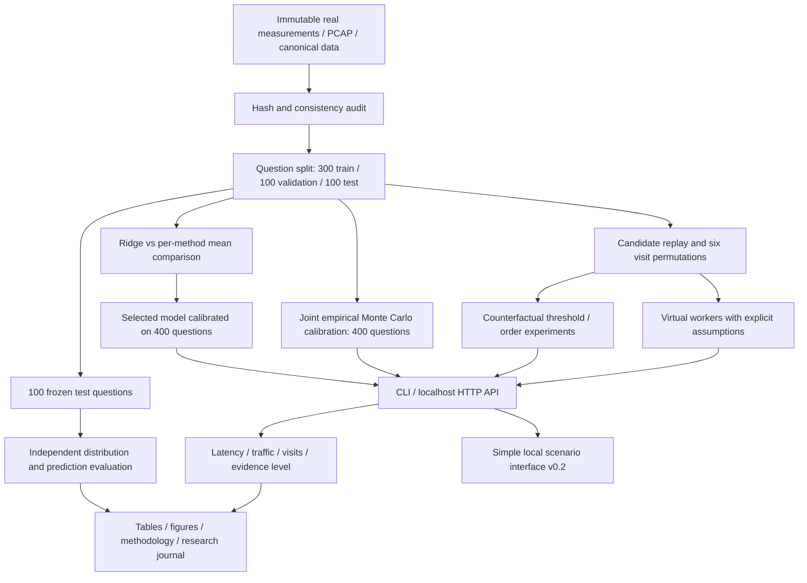

# Backend architecture

```mermaid
flowchart TD
  RAW[Immutable real measurements / PCAP / canonical data] --> AUDIT[Hash and consistency audit]
  AUDIT --> SPLIT[Question split: 300 train / 100 validation / 100 test]
  SPLIT --> TRAIN[Ridge vs per-method mean comparison]
  TRAIN --> FROZEN[Selected model calibrated on 400 questions]
  SPLIT --> MC[Joint empirical Monte Carlo calibration: 400 questions]
  SPLIT --> REPLAY[Candidate replay and six visit permutations]
  REPLAY --> TRACE[Counterfactual threshold / order experiments]
  REPLAY --> VIRTUAL[Virtual workers with explicit assumptions]
  FROZEN --> API[CLI / localhost HTTP API]
  MC --> API
  TRACE --> API
  VIRTUAL --> API
  API --> OUT[Latency / traffic / visits / evidence level]
  SPLIT --> TEST[100 frozen test questions]
  TEST --> EVAL[Independent distribution and prediction evaluation]
  EVAL --> PAPER[Tables / figures / methodology / research journal]
  OUT --> PAPER
  API --> UI[Simple local scenario interface v0.2]
```

The virtual-worker branch does not receive independent scaling labels. Its outputs cannot be used as measured training targets or proof of real scaling performance.
